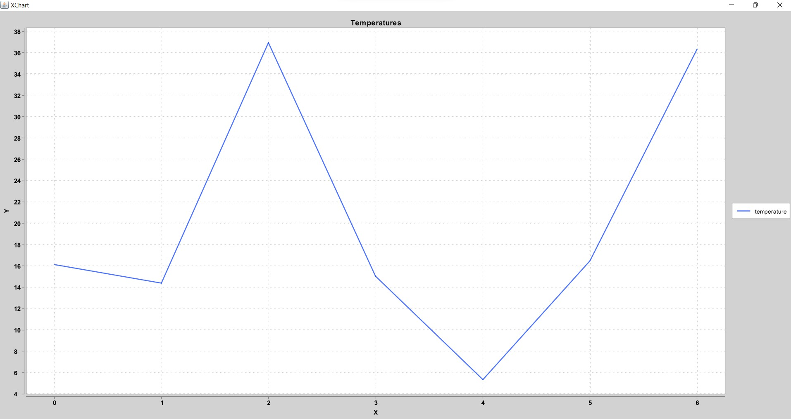

# ClientForSensor

**ClientForSensor** - это приложение-клиент, которое написано для тестирования RESTful веб-сервиса **SpringBootRESTSensor**. 
> Ссылка на репозиторий https://github.com/itbatia/SpringBootRESTSensor  

ClientForSensor взаимодействует с пользователем через консоль (куда и отдаёт полученные данные) + предоставляет график изменения температур.

### Характеристики:
:white_check_mark: Для запросов к SpringBootRESTSensor - __RestTemplate__   
:white_check_mark: Для парсинга объектов - __Jackson__    
:white_check_mark: Для отрисовки диаграмм - __Xchart__   

|       ***Пример из консоли:***       |
|:------------------------------------:|
|  |
|  |

### Инструкции для запуска приложения:

|             №             | Этапы выполнения                                                                                                                  |
|:-------------------------:|:----------------------------------------------------------------------------------------------------------------------------------|
|             1             | [Скопируйте код на свой ПК](https://github.com/itbatia/ClientForSensor/archive/refs/heads/master.zip)                             |
|             2             | Извлеките содержимое архива. В указанном месте появится папка с проектом ClientForSensor-master.                                  |
|             3             | Откройте проект в среде разработки и запустите класс Runner, предварительно запустив тестируемое приложение SpringBootRESTSensor. |
