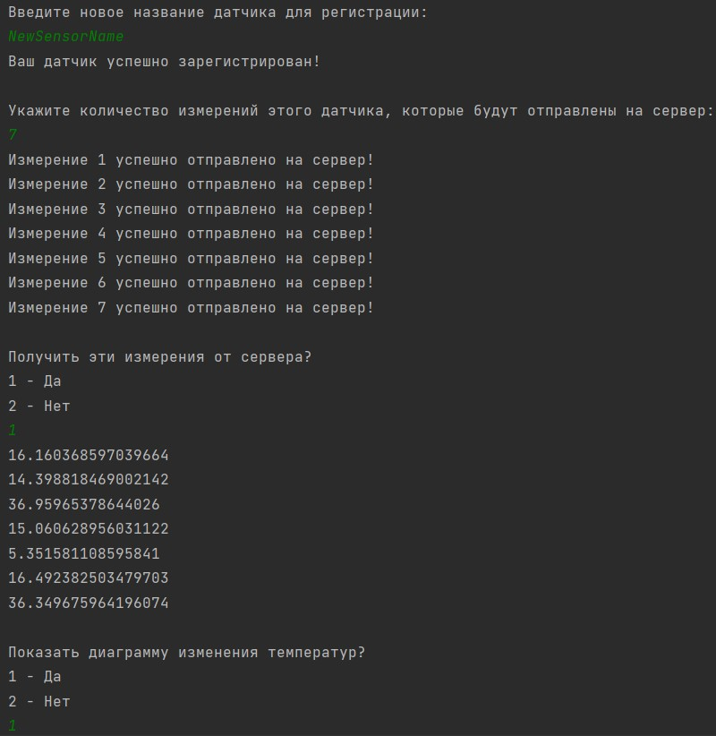

# ClientForSensor

**ClientForSensor** - это приложение-клиент, которое написано для тестирования RESTful веб-сервиса **SpringBootRESTSensor**. 
> Ссылка на репозиторий https://github.com/itbatia/SpringBootRESTSensor  

ClientForSensor взаимодействует с пользователем через консоль (куда и отдаёт полученные данные) + предоставляет график изменения температур.

### Характеристики:
:white_check_mark: Для запросов к SpringBootRESTSensor - __RestTemplate__   
:white_check_mark: Для парсинга объектов - __Jackson__    
:white_check_mark: Для отрисовки диаграмм - __Xchart__   

|       ***Пример из консоли:***       |
|:------------------------------------:|
|  |
|  |

### Инструкции для запуска приложения:

|             №             | Этапы выполнения                                                                                                                     |
|:-------------------------:|:-------------------------------------------------------------------------------------------------------------------------------------|
|             1             | [Скопируйте код на свой ПК](https://github.com/itbatia/ClientForSensor/archive/refs/heads/master.zip)                                |
|             2             | Извлеките содержимое архива. В указанном месте появится папка ClientForSensor-master.                                                |
|             5             | Зайдите в папку ClientForSensor-master и в адресной строке пропишите: cmd                                                            |
|             6             | Откроется командная строка, в которой необходимо прописать команду: mvn package. Результатом её выполнения будет примерно следующее: |
|                           |                                                                                                          |
|             8             | Затем пропишите команду: mvn exec:java -Dexec.mainClass="com.itbatia.app.Runner"                                                     |
|                           |                                                                                                          |
| :triangular_flag_on_post: | Программа запущена и готова к использованию!                                                                                         |

*Для последующих запусков выполняйте только пункты № 5 и 8.*